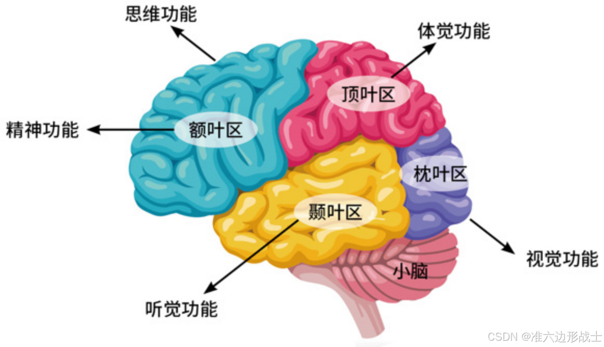
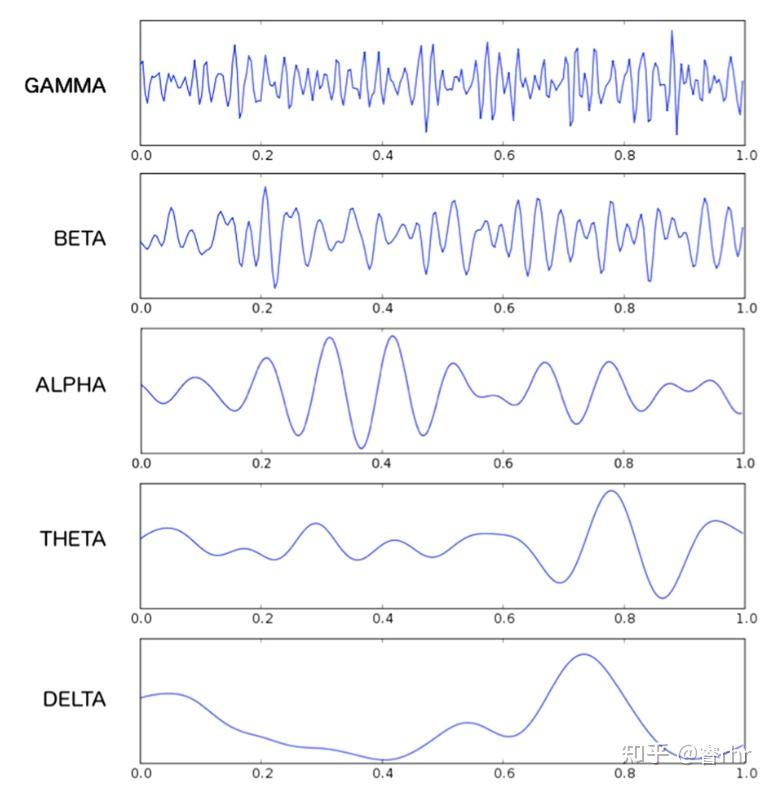
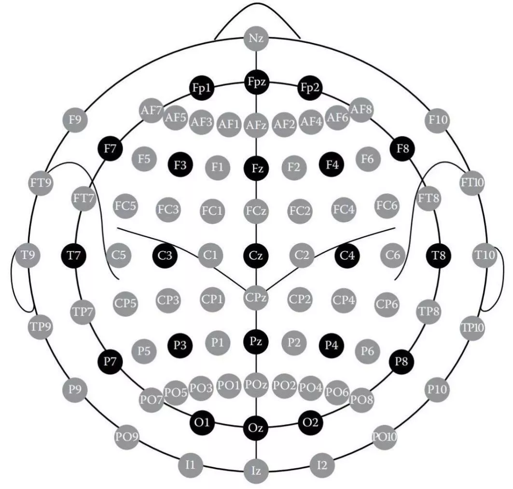

# EEG基础知识
_**定义：**_
脑电波（Electroencephalogram,EEG）是一种使用电生理指标记录大脑活动的方法，大脑在活动时，大量神经元同步发生的突触后电位经总和后形成的。 它记录大脑活动时的电波变化，是脑神经细胞的电生理活动在大脑皮层或头皮表面的总体反映。
---

## 1. 脑区功能分布 

- 额叶（负责思维，计划和中央执行职能以及运动执行）
- 顶叶（负责体感知觉，视觉和体空间信息的整合）
- 颞叶（主要负责语言功能和听觉感知，参与长期记忆和情感）
- 枕叶（主要负责视觉感知和处理）

---
## 2. EEG波段

- Delta波（0.5-4 HZ）
- Theta波（4-8   HZ）
- Alpha波（8-13  HZ）
- Beta 波（13-30 HZ）
- Gamma波（30-50 HZ）
- **_工频干扰_**

---
## 3. 通道分布

- F：额叶（Frontal lobe）
- Fp：前额叶（Frontal poles）
- T：颞叶（Temporal lobes）
- O：枕叶（Occipital lobes）
- P：顶叶（Parietal lobes）
- C：中心部（Central）或感觉运动皮层
- Z：零点（zero）即左右脑中心

---
## 4. 相关研究

- 睡眠阶段检测
- 癫痫（异常）检测
- 抑郁症（奥尔默兹）等
- 情绪计算（分类）
- 运动想象
- 表征学习（通用模型）

--- 
## 其他相关链接
- https://zhuanlan.zhihu.com/p/15102370282
- https://zhuanlan.zhihu.com/p/467339680

